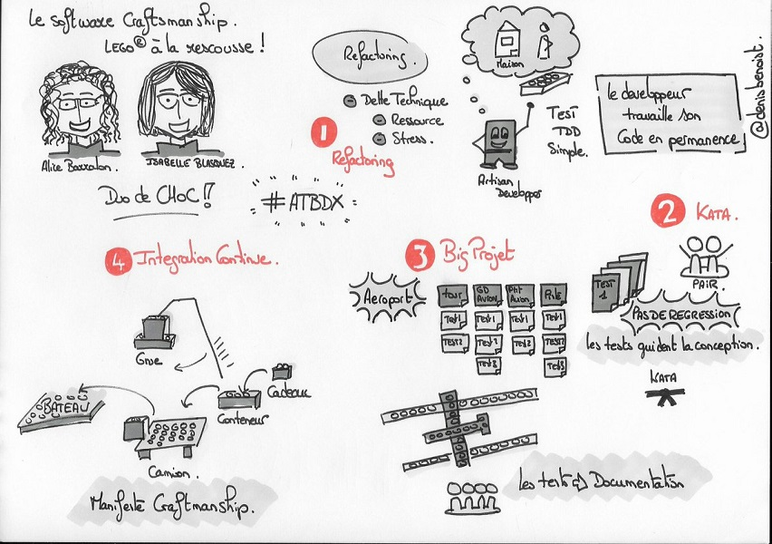

# Sensibilisation aux bonnes pratiques techniques du Software Craftsmanship : Lego® à la rescousse ! 

Vous trouverez ici les supports ayant servi à animer l'atelier **Sensibilisation aux bonnes pratiques techniques du Software Craftsmanship : Lego® à la rescousse !** 

***Cet atelier permet de (re)découvrir les bonnes pratiques techniques en s'amusant : TDD, Clean Code, Refactoring, Dette Technique et Integration Continue sont au programme !  
Pas la peine de savoir coder ! L'usage de briques Lego® offre l'opportunité à tous (développeurs ou non) de manipuler ces concepts.    
Chers gens du métier, venez découvrir ce qu'est un développeur agile.  
Chers développeurs, venez pratiquer l'eXtreme LegoBuilding avec le framework LegoUnit !***

**Il est à noter que cet atelier s'appuye sur de petits exercices proposés initialement par [Bryan Beecham](https://twitter.com/BillyGarnet) et [Mike Bowler](https://twitter.com/mike_bowler) dont le descriptif original est disponible sur [http://www.gargoylesoftware.com/ex]( http://www.gargoylesoftware.com/ex).**

## Supports de l'atelier

* [Devoxx France](https://www.devoxx.fr/) (Avril 2017) : [transparents de l'atelier](slides/tddLego_DevoxxFR_2017.pdf)  
* [Agile Tour Toulouse](http://tour.agiletoulouse.fr/) (Décembre 2016) : [transparents de l'atelier](slides/tddLego_attls_2016.pdf)
* [Agile Grenoble](http://agile-grenoble.org/) (Novembre 2016) : [transparents de l'atelier](slides/tddLego_AgileGrenoble_2016.pdf)
* [Agile Tour Bordeaux](http://atbdx.nostradamnit.com/) (Octobre 2016) : [transparents de l'atelier](slides/tddLego_atbdx_2016.pdf)
* [Bdx.io](http://www.bdx.io/) (Octobre 2016) : [transparents de l'atelier](slides/tddLego_Bdxio_2016.pdf) (ajout Intégration Continue)
* [Agile Pays Basque](http://agile-paysbasque.fr/) (Septembre 2016) : [transparents de l'atelier](slides/tddLego_AgilePB_2016.pdf) (version détaillée)

L'atelier a également été réalisé auprès d'étudiants dans le cadre d'un [module d'initiation au développement logiciel agile](https://github.com/iblasquez/enseignement-developpement-logiciel-agile).

## Photos
Des photos de ces ateliers sont disponibles sur la page [photos](photos.md).  
Si vous disposez de photos que vous souhaitez partager, n'hésitez pas à les ajouter !  

D'autres photos sont visibles sur Twitter à partir des hashtag [#tddLego](https://twitter.com/search?q=%23tddLego) et [#tddLegos](https://twitter.com/search?q=%23tddLego).

## Aller plus loin ...
A l'issue de cet atelier, certains se demandent peut-être : **Et avec du code, ça donnerait quoi ?**  
Voici quelques pistes pour en savoir plus ...

### Envie d'en savoir plus sur le TDD ?
* [Introduction au TDD : Kata Fizz Buzz](https://www.youtube.com/watch?v=RWYvBNX9wcU) : vidéo réalisée par   [Nadia Humbert ](https://twitter.com/nphumbert) (Le kata Fizz Buzz est le hello world du TDD !)

* [Coding Dojo : une aide à la pratique du TDD](http://iblasquez.github.io/presentation_TDD_CodingDojo)  

* De nombreux katas pour s'entrainer sur le [github d'Emily Bache](https://github.com/emilybache)  
  [Emily Bache](http://coding-is-like-cooking.info/)  est l'auteur des livres : [The Coding Dojo Handbook](https://leanpub.com/codingdojohandbook) et [Mocks, Fakes and Stubs](https://leanpub.com/mocks-fakes-stubs)

* Mindmap autour des bonnes pratiques du TDD : jetez un petit coup d'oeil sur [TDD Good Habits manifesto](https://github.com/neomatrix369/refactoring-developer-habits/blob/master/02-outcome-of-collation/tdd-manifesto/tdd-good-habits-manifesto.md)  
[101 TDD Tips Book](http://www.codemanship.co.uk/files/101TddTips.pdf) par [@Codemanship](https://twitter.com/codemanship) 

* Les livres de référence sur le TDD :
	*  [Test Driven Development: By Example](https://www.amazon.fr/Test-Driven-Development-Kent-Beck/dp/0321146530) de [Kent Beck](https://twitter.com/KentBeck) (TDD classique)
	*  [Growing Object-Oriented Software, Guided by Tests](https://www.amazon.fr/Growing-Object-Oriented-Software-Guided-Tests/dp/0321503627) de [Steve Freeman](https://twitter.com/sf105) et [Nat Pryce](https://twitter.com/natpryce)(TDD mockiste)  

### Envie d'en savoir plus sur le refactoring ?
* [Introduction au Refactoring](https://www.youtube.com/watch?v=sxQAULX96P0) : vidéo réalisée par [Nadia Humbert ](https://twitter.com/nphumbert)

* Des catalogues présentant des techniques de refactoring :  
  [http://refactoring.com/catalog/](http://refactoring.com/catalog) sur le site de [Martin Fowler](https://twitter.com/martinfowler)  
  [https://sourcemaking.com/refactoring](https://sourcemaking.com/refactoring) 
 

* Le livre de référence sur le refactoring :   
	 [Refactoring, Improving the Design of Existing Code](http://martinfowler.com/books/refactoring.html) de [Martin Fowler](https://twitter.com/martinfowler)  
	
* [Tutoriel s'appuyant sur l'exemple simplifié du premier chapitre du livre Refactoring](https://github.com/iblasquez/Refactoring_PremierExempleFowler)

* Des vidéos de refactoring sur du legacy code :
	* **Kata trip service** :  
		Vidéo : [Testing and Refactoring Legacy Code](https://www.youtube.com/watch?v=_NnElPO5BU0) par [Sandro Mancuso](https://twitter.com/sandromancuso)  
		Le code de ce kata est disponible [ici](https://github.com/sandromancuso/trip-service-kata)    
		[Sandro Mancuso](https://twitter.com/sandromancuso) est également l'auteur de [The Software Craftsman: Professionalism, Pragmatism, Pride](http://www.amazon.co.uk/books/dp/0134052501/)  

	* **Kata Guilded Rose**  
		Vidéo : [Du Legacy au Cloud en moins d'une heure à l'USI](https://www.youtube.com/watch?v=q11gydDAMSo) par [David Gageot](https://twitter.com/dgageot)  
		Le code de ce kata est disponible [ici](https://github.com/emilybache/GildedRose-Refactoring-Kata).  
	
### Envie d'en savoir plus sur Software Craftsmanship ?

* Le livre de référence sur le Software Craftsmanship :   
	 [The Software Craftsman: Professionalism, Pragmatism, Pride](https://www.amazon.fr/Software-Craftsman-Professionalism-Pragmatism-Pride-ebook/dp/B00QXAGIDO) de [Sandro Mancuso](https://twitter.com/sandromancuso)
	

* Autres lectures :  
	[Artisan développeur par Gilles Roustan](http://gb-prod.fr/2016/06/12/artisan-developpeur.html)  
 	[How Can You Say You’re A Software Crafts(wo)man? Or what makes you a Software Crafts(wo)man par Alessandro Baffa](https://medium.com/alebaffa-blog/how-can-you-say-youre-a-software-crafts-wo-man-48ebc055ba9d)

## Sketchnoting 
  

Merci à [Denis Benoist](https://twitter.com/DenisBenoist) pour ce [Sketchnoting](https://twitter.com/DenisBenoist/status/793005892107112449) !

## Licence
Tous les documents sont placés sous licence CC BY-NC-SA :  [Creative Commons
Attribution - Pas d'Utilisation Commerciale - Partage dans les Mêmes Conditions](https://creativecommons.org/licenses/by-nc-sa/4.0/)

En savoir plus sur [les licences Creative Commons](https://creativecommons.org/licenses/?lang=fr-FR) ...
